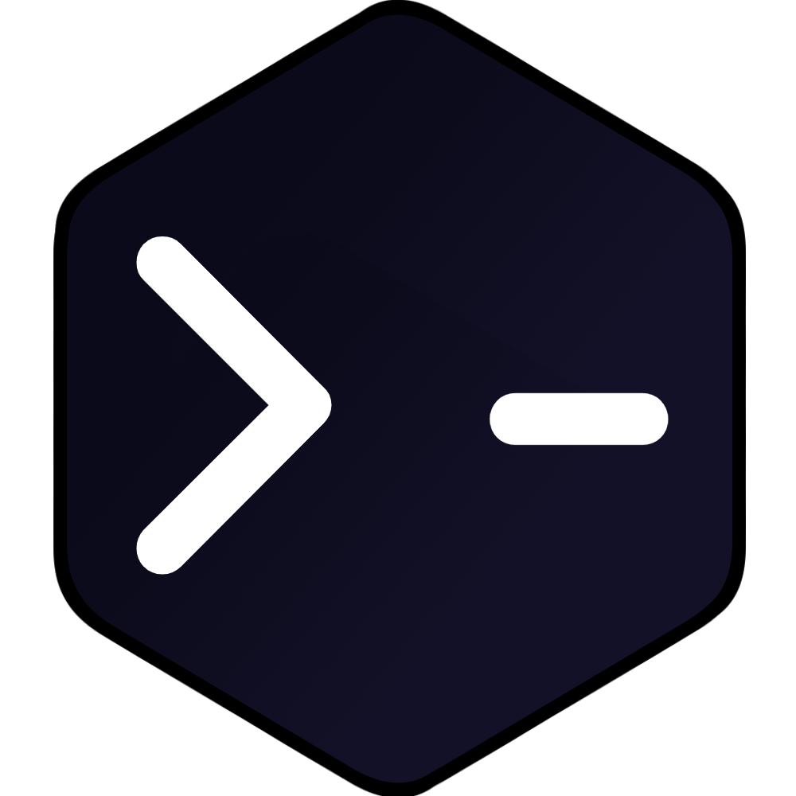

#  AO
## :wave: Introduction
### :question: What is AO?
> 1. **AO** stands for **Automate Output** much like **IO (Input Output)**.<br>
> 2. AO is build to work as an **automation tool** for programmers.<br>
> 3. Basically you can **write simple scripts in any language** and use **call them whenever you want**.<br>
> 3. One great thing about AO is that **you can call those scripts from anywhere**.<br>
> 4. From a **Python file**, from a **C++ file** or even from a simple **server/API** request.<br>
> 4. At least that's what my aim is with AO.<br>
> 5. Also I'm building AO as an **execution engine** for my **personal AI assistant** [WINTER](https://github.com/SrijanSriv211/WINTER)

### :question: Why am I working on it?
> I started working on AOs as a hobby project back in 2020. Originally the project was written in Python but then I shifted the project to C#.
> I worked on AOs as to better learn C# programming language or just do some time pass.
> 
> Now I'm rewriting AOs in C++ and I've actually renamed it to AO. I don't know why but it sounds cool.<br>
> The old repository is **https://github.com/SrijanSriv211/AOs**

***

## :toolbox: Getting started
AO is officially untested on other development environments whilst I focus on a Windows build, but you can modify it to work cross-platform.

### :bangbang: Prerequisites
You need to install the following on your machine.
- [Mingw-w64](https://www.mingw-w64.org/downloads/#mingw-builds) >= C++ 20
- [Python](https://www.python.org/downloads) >= 3.12

### :pencil: Getting AO
<ins>**1. Downloading the repository:**</ins>

Start by cloning the repository with `git clone --recursive https://github.com/SrijanSriv211/AO`.

If the repository was cloned non-recursively previously, use `git submodule update --init --recursive` to clone the necessary submodules.

<ins>**2. Running and Compiling AO:**</ins>

1. To run the program use:
```console
python scripts\build.py run
```

2. To compile the program don't use dotnet build, instead run:
```console
python scripts\build.py
```
